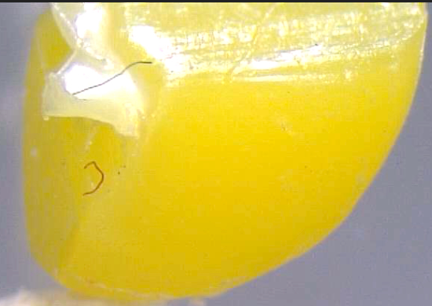
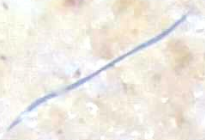
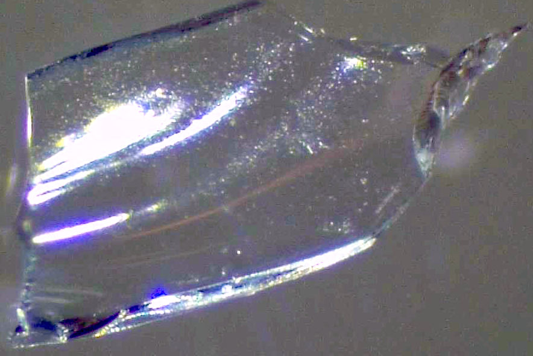
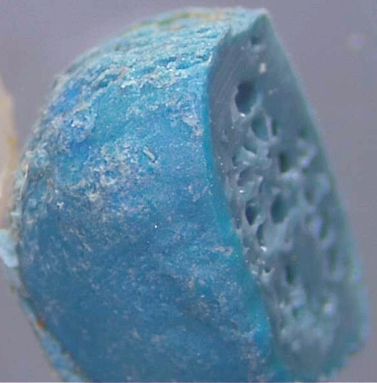
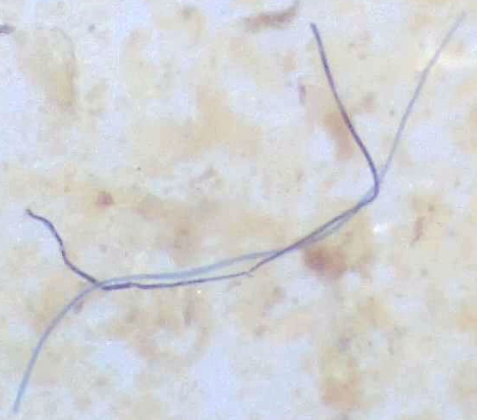
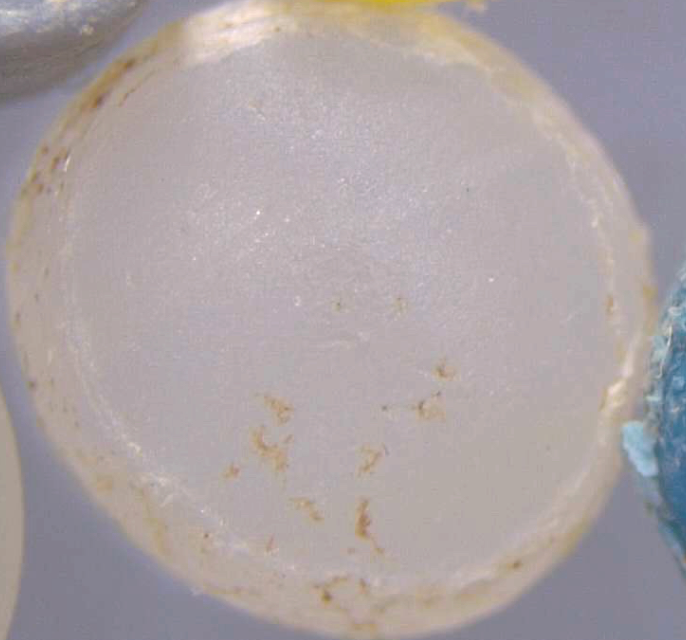

# 🌊 AI Microplastics Detection System


> **A specialized image detection program that uses Deep Learning to identify and classify microplastics in water samples.**

*(Note:Here is the sample of the responsive website which is live and sample pic and the anlysis of thosesample)*


<p align="center">
  
  
  
  
  
 
  
</p>

## 📖 Overview
Microplastic pollution is a growing environmental crisis. This project provides a web-based, AI-driven solution to identify and classify microplastics from water samples (specifically trained on data from the Boise River Basin). 

By utilizing **Transfer Learning** with Google's **Inception model**, this system can analyze an uploaded microscopic image and accurately determine the percentage breakdown of different microplastic types.

### 🔬 Classification Categories:
* 🟢 **Beads:** Spherical plastic particles
* 🧵 **Fibers:** Thread-like plastic structures
* 📄 **Films:** Thin plastic sheets
* ☁️ **Foam:** Polystyrene and expanded plastics
* 🧩 **Fragments:** Broken down pieces of larger plastics
* 🌿 **Organic Matter:** Natural plant or algae material

---

## ✨ Key Features
* **Real-Time AI Processing:** Connects a custom TensorFlow machine learning model to a web interface via a Flask REST API.
* **Interactive UI:** Features a modern, responsive Glassmorphism design that looks great on both desktop and mobile devices.
* **Drag & Drop Upload:** Seamlessly drag images into the browser for instant analysis.
* **Dynamic Theme Switching:** Fully integrated Light and Dark modes.
* **Interactive Background:** Features a custom HTML5 Canvas neural network particle animation that responds to the current theme.

---

## 🛠️ Technology Stack
**Frontend:**
* HTML5, CSS3 (Custom Variables, Flexbox/Grid, Media Queries)
* Vanilla JavaScript (ES6+, Fetch API, Canvas API)

**Backend:**
* Python 3.x
* Flask & Flask-CORS (REST API routing)
* TensorFlow & Keras (Model execution)
* Pillow (PIL) & NumPy (Image preprocessing)

---

## 🚀 Installation & Setup

Want to run this project locally on your machine? Follow these step-by-step instructions.

### Prerequisites
* Python 3.8 or higher installed
* A modern web browser

### Step 1: Clone the Repository
```bash
git clone [https://github.com/bizay047/Microplastic-Detection.git](https://github.com/bizay047/Microplastic-Detection.git)
cd Microplastic-Detection

```


---
### Step 2: Install Backend Dependencies
```bash
pip install -r requirements.txt
```
---
### Step 3: Add Your Model
* Ensure your trained TensorFlow model file (e.g., inception_model.h5) is placed in the root * directory. Update the MODEL_PATH variable in app.py to match your filename.

---
### Step 4: Run the Flask API Server
```bash
python app.py
```
* The server will start running on http://127.0.0.1:5000.

---
### Step 5: Launch the Web App
* Simply double-click the index.html file to open it in your web browser.
* Drag and drop an image, and watch the AI work!

---

### 🔮 Future Improvements

This project is continuously evolving. Planned future updates include:

* Live Camera Feed: Integrating WebRTC to allow real-time classification through a digital microscope camera.

* Dataset Expansion: Training the model on a wider variety of global water basin samples to improve accuracy.

* Exportable Reports: Adding functionality to generate and download PDF reports of the analysis results.

* Cloud Deployment: Hosting the Flask backend on platforms like Heroku, Render, or AWS for public access.

---
### 👨‍💻 Credits & Acknowledgements

>**Developed for the mini project for the 6th semester to School of Computer Science & Engineering at KIIT University.
Under the guidance of: MR. A Ranjit.**
